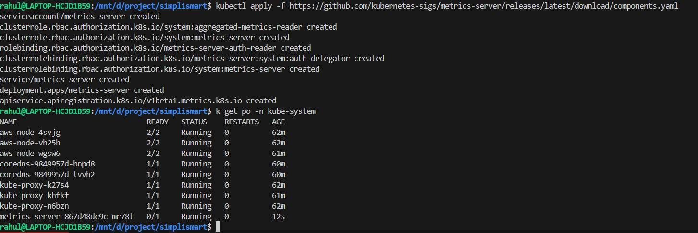
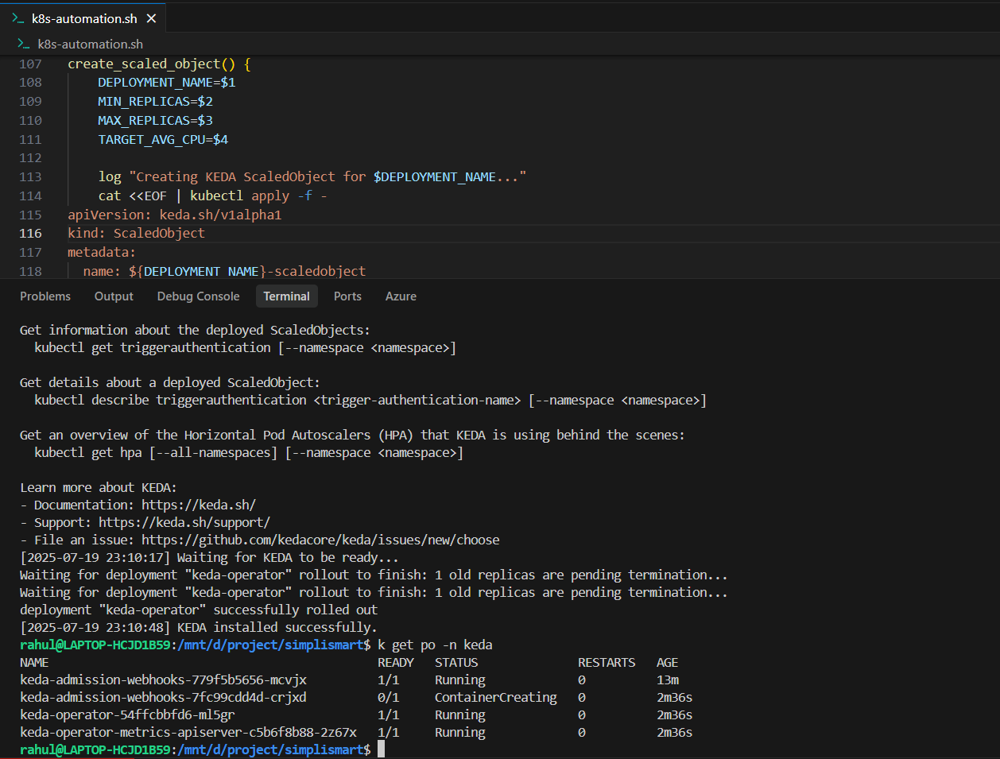

# Kubernetes Cluster Automation with KEDA

This script provides a simple command-line interface to manage Kubernetes deployments with KEDA (Kubernetes Event-Driven Autoscaling) support, including CPU-based autoscaling.

## Prerequisites

- `kubectl` installed and configured to communicate with your cluster
- `helm` (v3+) installed
- Kubernetes cluster (v1.33)
- Metrics Server installed in your cluster, if not installed, run the following command:
  ```bash
  kubectl apply -f https://github.com/kubernetes-sigs/metrics-server/releases/latest/download/components.yaml
  ```
  

## Installation

1. Clone this repository:
   ```bash
   git clone <repository-url>
   cd keda-k8s-scaling
   ```

2. Make the script executable:
   ```bash
   chmod +x k8s-automation.sh
   ```

## Usage

### Show Help
```bash
./k8s-automation.sh
```

### Setup Cluster Tools
```bash
# Install Helm and KEDA
./k8s-automation.sh setup
```

### Deploy an Application
```bash
# Deploy an application with resource requests/limits
./k8s-automation.sh deploy myapp nginx:latest "100m" "200m" "128Mi" "256Mi" 80
# Parameters: <name> <image> <cpu_request> <cpu_limit> <ram_request> <ram_limit> <port>
```

### Configure Autoscaling
```bash
# Configure CPU-based autoscaling
./k8s-automation.sh scale myapp 1 5 "50"
# Parameters: <deployment> <min-replicas> <max-replicas> <target-cpu-utilization>
```

### Check Deployment Status
```bash
./k8s-automation.sh status myapp
```

### Select Kubernetes Context
```bash
# List and select available Kubernetes contexts
./k8s-automation.sh context
```

## Complete Workflow Example

1. Select your Kubernetes context:
   ```bash
   ./k8s-automation.sh context
   ```

2. Set up cluster tools (Helm + KEDA):
   ```bash
   ./k8s-automation.sh setup
   ```

3. Deploy a sample application:
   ```bash
   ./k8s-automation.sh deploy nginx nginx:latest "100m" "200m" "128Mi" "256Mi" 80
   ```

4. Configure autoscaling:
   ```bash
   ./k8s-automation.sh scale nginx 1 5 "50"
   ```

5. Check the deployment status:
   ```bash
   ./k8s-automation.sh status nginx
   ```

## Troubleshooting

- **KEDA not installing**: 
  - Ensure you have cluster admin permissions
  - Verify metrics server is installed and running
  - Check KEDA logs: `kubectl logs -n keda -l app=keda-operator`

- **Autoscaling not working**:
  - Verify metrics server is working: `kubectl top pods`
  - Check HPA status: `kubectl get hpa`
  - Check KEDA ScaledObject: `kubectl get scaledobject`

- **Connection issues**:
  - Verify kubeconfig: `kubectl config view`
  - Check cluster connectivity: `kubectl cluster-info`

## Screenshots

### KEDA Successfully Deployed
